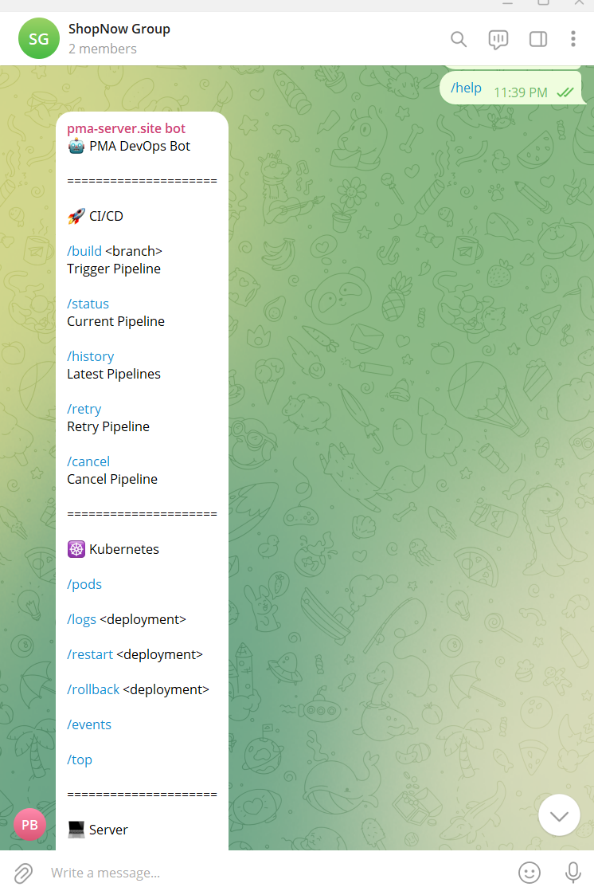
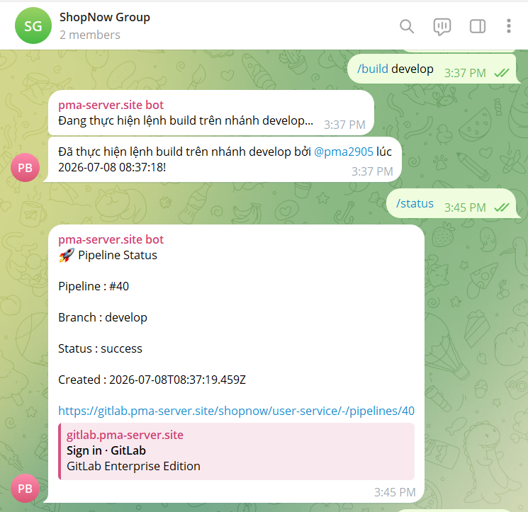

# Telegram ChatOps Automation

A lightweight **Bash-based ChatOps bot** that integrates Telegram with my DevOps lab environment, allowing CI/CD, Kubernetes, Harbor, and server operations to be monitored and managed remotely from a mobile device.

> This is a personal DevOps lab project designed to explore ChatOps, operational automation, and remote infrastructure management.

## Overview

The bot runs on a dedicated **Admin Server** and uses Telegram as the operational interface.

Instead of connecting directly to servers for common checks, operational commands can be executed through Telegram.

```text
Telegram
    |
    v
Telegram Bot API
    |
    v
Admin Server
    |
    +--- Bash ChatOps Bot
    |
    +--- GitLab CI/CD
    |
    +--- Kubernetes
    |
    +--- Harbor Registry
    |
    +--- Dev Server

# 🚀 Demo

### Telegram Command List



---

### Trigger GitLab Pipeline



---

### Pipeline Status


